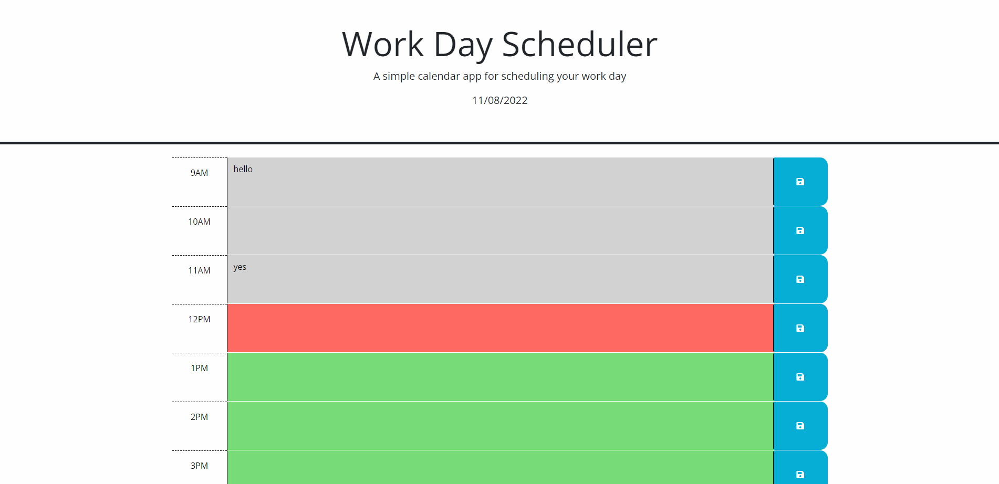

# 05 Work Day Scheduler
Purpose: Displays the date. Produces a work-day scheduler from 9am-5pm that color codes: the current hour, the past hours, and the future hours differently. This planner also allows the user to save scheduled events in the planner text input areas.

Display:

